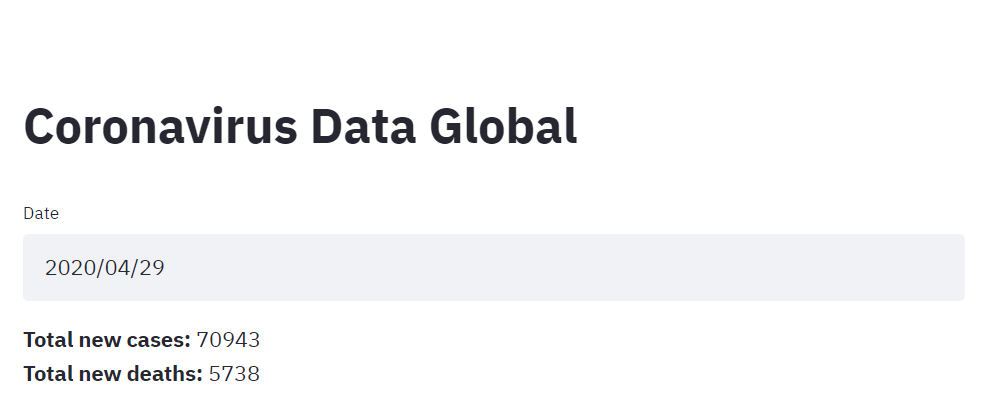
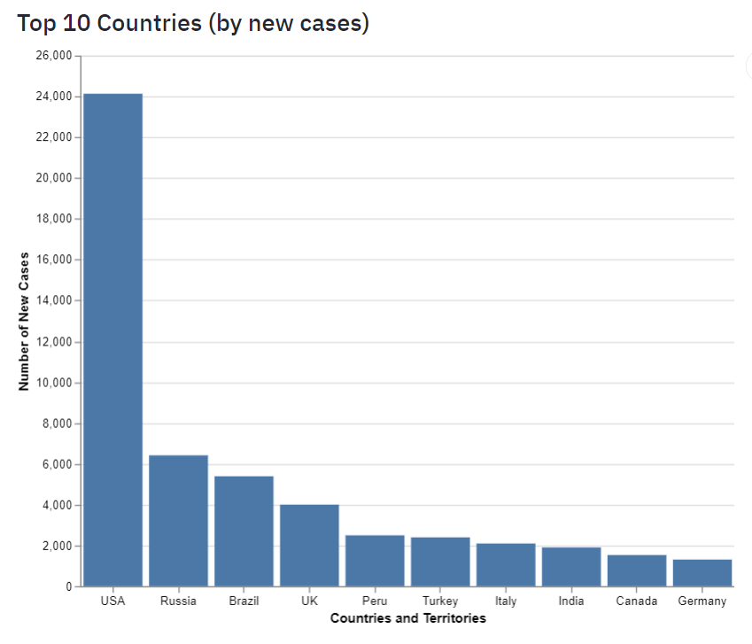
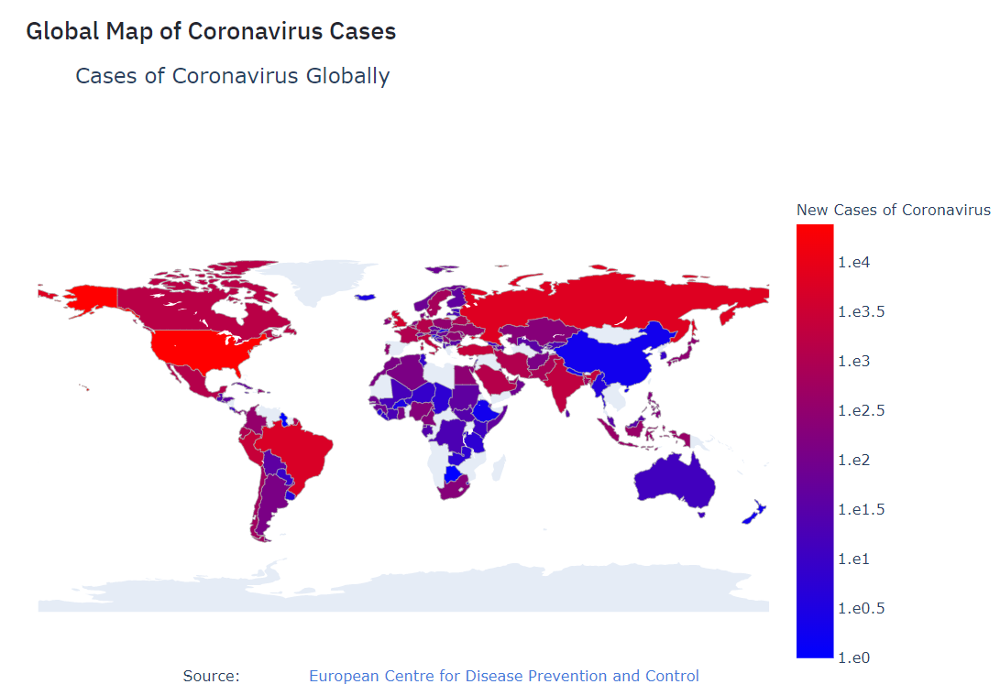

## Description
---
* This is a dashboard that pulls data about coronavirus realtime.
* There are 3 components to this dashboard:
1. Pick the date where you want to analyze the coronavirus data:  
  
There are captions below that provide the number of new cases and deaths globally for the selected date.  
2. It provides the top 10 countries by new cases of coronavirus globally:

3. There is a choropleth map, showing the number of new cases and number of new deaths in each country.


## Running the app:
---
* Note that streamlit must be installed. If you are running locally, run this command in project folder:
```bash
pip install -r requirements.txt
```
* To run locally, run command in the project folder:
```bash
streamlit run main.py 
```
* Alternatively, build and run a docker image from the Dockerfile provided.